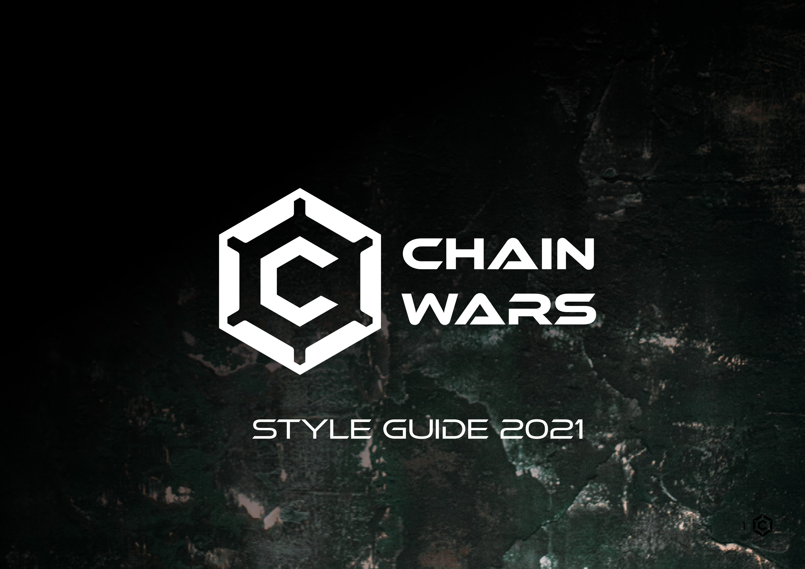
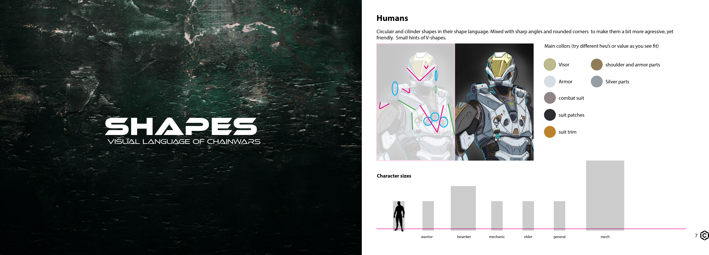
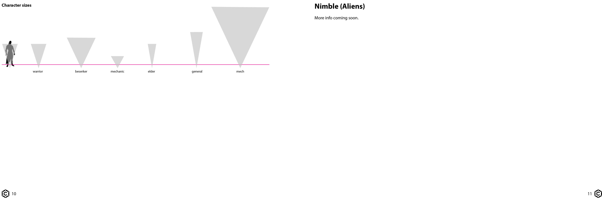

# Earn for Contributions

Chain Wars aspires lots of participation from the community as it strives to gradually decentralize the game over time and make it a community experience. We think art can play a huge role in accomplishing our vision. That's why we ask the community to make contributions which we will rate and if viable, use for our game. Our team of professional designers will rate your contributions and possibly provide you with useful feedback. We will also reward 600 USD worth of CWE for each viable design.

We made a Style Guide for new designers we hire and for the community who want to make contributions. These are the guidelines our designers use for creating and will also be a support for rating contributions.

