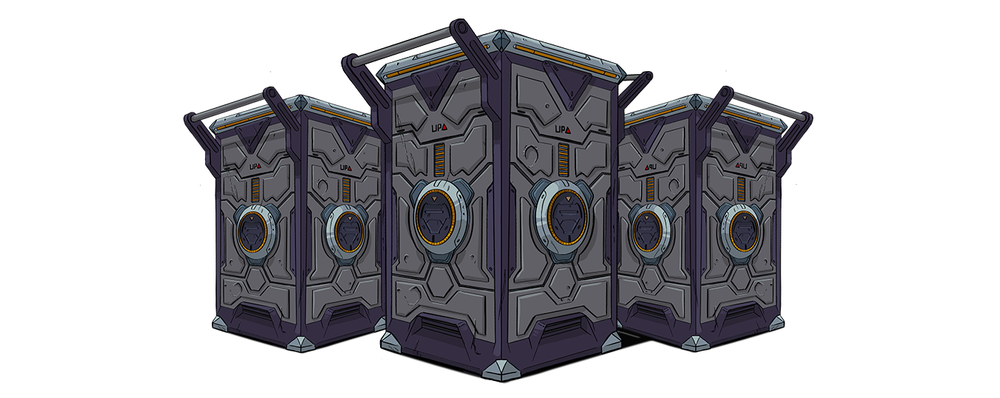

# Rewards & Earnings

### Lootboxes

These will be for sale on the NFT-marketplace \(~5 USD in $CWE\) and obtainable via the completion of all weekly quests. Events will provide even more ways to obtain lootboxes. Each lootbox has a chance to drop cards in a certain rarity and form. The rarity will determine how strong the card is. The form is a cosmetic feature. See the tables below to find out about the drop rates.

Forging also allows players to farm stronger cards with lesser ones. This will consume resources and patience though. Read more about this in the Forging section.

| Common \(65%\) | Drop Rate of Form |
| :--- | :--- |
| Gold | 75% |
| Holo | 24% |
| Rainbow | 1% |

| Rare \(29%\)         | Drop Rate of Form |
| :--- | :--- |
| Gold | 75% |
| Holo | 24% |
| Rainbow | 1% |

| Epic \(5%\)            | Drop Rate of Form |
| :--- | :--- |
| Gold | 75% |
| Holo | 24% |
| Rainbow | 1% |

| Legendary \(1%\) | Drop Rate of Form |
| :--- | :--- |
| Gold | 75% |
| Holo | 24% |
| Rainbow | 1% |

### Season prizes

We will allocate 10% of mint per block for Nimble and Origon to be awarded as auto-injection to the top 20 players. 1.325 x 30 = 39.750 is the share of daily emission to be distributed amongst the top 20. 1.325 is 10% of daily emission. 30 is the amount of days in a season \(monthly\).

| Rank | Percentage of share \(%\) |
| :--- | :--- |
| Number 1 | 10 % + Season Winner Emblem |
| Number 2 - 3 | 7.5 % + Season Winner Emblem |
| Number 4 - 5 | 5 % + Season Winner Emblem |
| Number 6 - 10 | 5 % |
| Number 11 - 20 | 4 % |

### Reward per Win

For each win, you get suitable rewards. These depend on your current level and skill \(the latter is measured with the division you're playing in\).

### Daily Quests

These will contain three preset quests, centivizing players to spend a small amount of time each day playing the game. This will result in faster matchmaking and stronger decks. The preset daily quests;

* Daily Check-In.
* Play 5 games.
* Win 3 games.

### Weekly Quests

You can also obtain rewards on weekly basis by completing weekly quests. These are 5 quests which will differ but come down to playing certain cards, playing/winning an x amount of games or minor quests related to the decentralized exchange.

### Referrals

Referrals allow you to invite up to 10 friends and get rewards. More to come.

