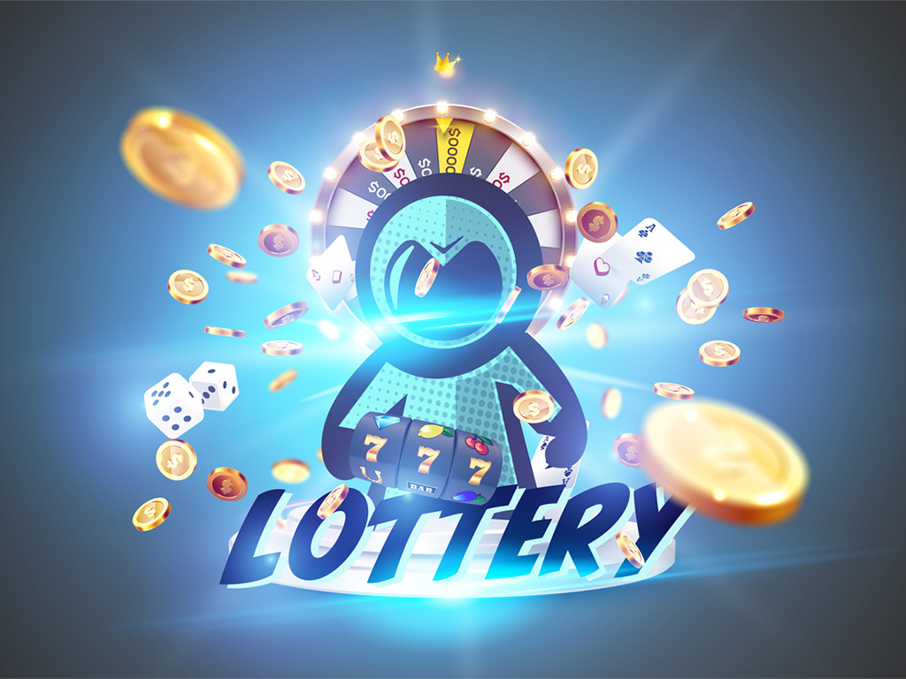
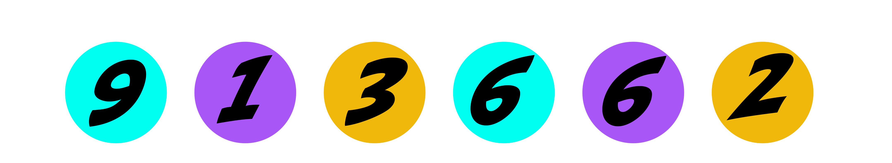
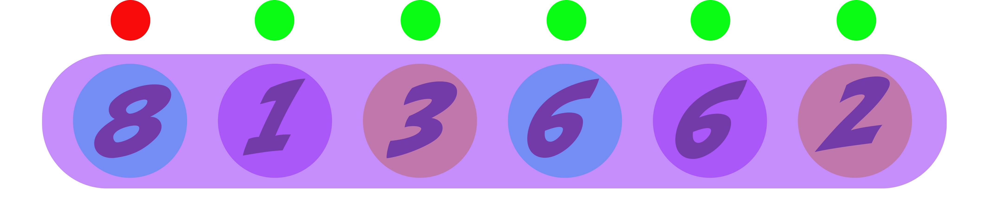

# Lottery

## Summary

* As long as you have the sufficient funds to buy a ticket, you can always participate!
* There is no limit for the amount of entries, although **there** **is** a limit of 100 tickets to the amount of tickets per purchase \(you can buy more tickets using multiple purchases\).
* To guarantee true randomness and therefore a 100% fair lottery, we use Chainlink's implementations of VRF.
* Participants will receive a 6-digit code consisting out of the numbers 0-9. For example, a given code could be '9-1-3-6-6-2'. To win prizes, your code has to match the lottery outcome from left to right.
* Price for a ticket is ~5 USD in MLTPX.

## The Lottery

As mentioned, every user can own an unlimited amount of tickets for a lottery. Every lottery has 6 predetermined prizebrackets \(correlative to the 6 digits in the lottery code\). From left to right, the amount of numbers on your ticket matching the lottery code is the price bracket you're in. The numbers need to match in **sequential** order from **left to right**. Every number after the first non-matching number is not eligible.

This could mean you have 5 matching numbers but no prize. Or 1 matching number and a small prize.  Don't worry, it's not as complicated as it seems. Check the examples below;

This could be one of your tickets. As you can see, the last two numbers also match the lottery outcome. Unfortunately these numbers aren't eligible because the fourth number breaks the sequence. You would be in the third prizebracket on this ticket.

Another example. As you can see, this is a very unlucky draw. All numbers match except for the first one, which makes all following numbers in de sequence ineligible.

## The Prizes

The more matches your ticket has from left to right, the better the prizebracket and prizepool. The prizes are determined by the following factors; amount of participants and earnings of prizepools in recent lotteries. If recent lotteries haven't wont the jackpot or not many prizes overall, the prizepools will increase.

The distribution of prizes is simple. Every ticket that ends in a pizebracket takes an equal share of the prize. For example, if one of your tickets has prizebracket 4, and one other ticket has the same prizebracket, you will get 50% of the prize. Getting in a prizebracket **does not** mean you get the prizebrackets below that as wel \(on the same ticket\). For example, if you get prizebracket 3 on a ticket, you won't also get prizebracket 2 and prizebracket 1.

## The Tickets

You can buy tickets via our dex **insert link.** 1 up to 100 tickets can be obtained with one purchase. If you want to buy many tickets, consider buying them in bulk purchases as these will provide a discount up to 5% if you order 100 tickets in one purchase. However, bulk discount starts at 2 tickets and it scales up towards 100 tickets.

**INSERT BULK DISCOUNT IMAGES**

