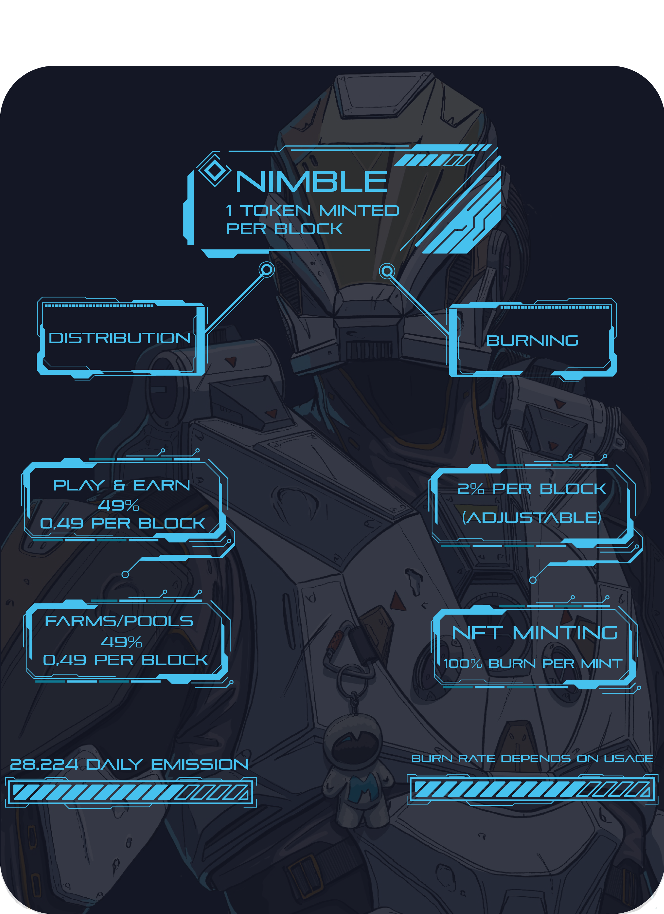

# Tokenomics Nimble

## **Emission rate** 

### **Per block**

| **Metric** | **Emission/block \(NIMBLE\)** |
| :--- | ---: |
| Emission | 1 |
| Burned | -0,02 |
| **Effective Emission** | **0,98** |

### Per day 

| **Metric** | **Emission/day \(NIMBLE\)** |
| :--- | ---: |
| Emission | 28,800 |
| Burned | -576 |
| **Effective Emission** | **28224** |

## Distribution 

| Distributed to | Reward/block \(% of emission\) | Reward/block \(total NIMBLE\) | Reward/day |
| :--- | ---: | ---: | ---: |
| Farms and Supernova | 49% | 0.49 | 14112 \(~\) |
| Play and Earn | 49% | 0.49 | 14112 \(~\) |
| **Total Daily NIMBLE Emission** |  |  | **28244 \(approx\)** |

## Deflation Mechanics

* **100%** Nimble spent on Profile Creation & NFT Minting
* **19%** Nimble spent on Lottery

