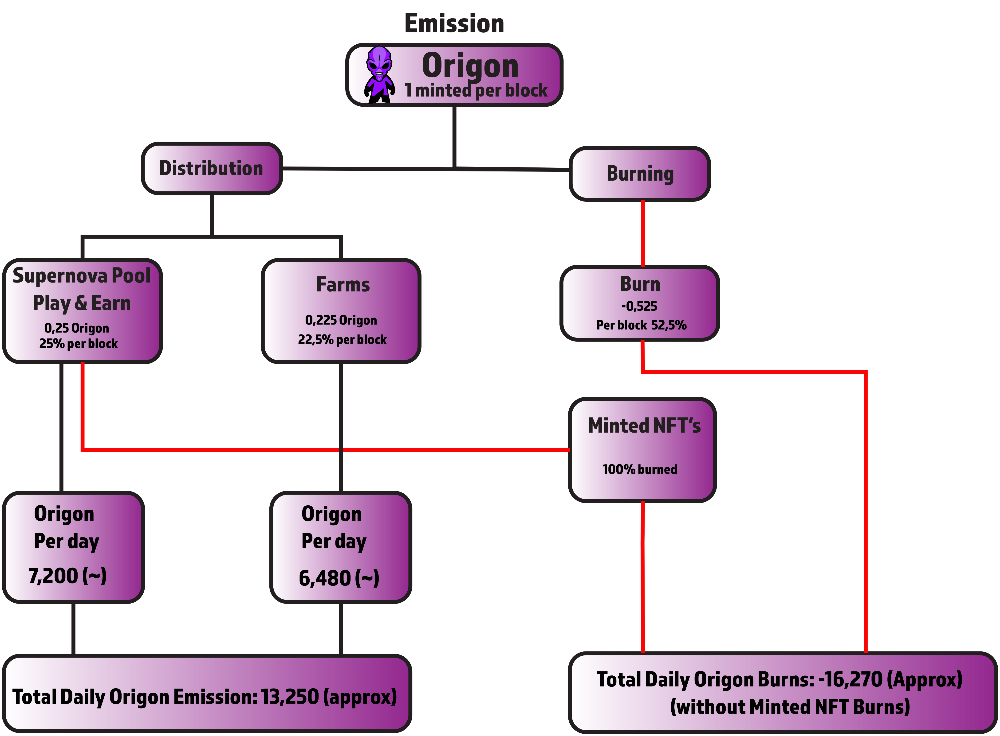

# Tokenomics Origon

## **Emission rate** 

### **Per block**

| **Metric** | **Emission/block \(ORIGON\)** |
| :--- | ---: |
| Emission | 1 |
| Burned | -0,525 |
| **Effective Emission** | **0,475** |

### Per day 

| **Metric** | **Emission/day \(ORIGON\)** |
| :--- | ---: |
| Emission | 28,800 |
| Burned | -16,270 |
| **Effective Emission** | **12,530** |

## Distribution 

| Distributed to | Reward/block \(% of emission\) | Reward/block \(total ORIGON\) | Reward/day |
| :--- | ---: | ---: | ---: |
| Farms and Lottery | 22.5% | 0.225 | 6,480 \(~\) |
| of which diverted and burned |  |  | -1,150 |
| Supernova Pools | 25% | 0.25 | 7,200 \(~\) |
| **Total Daily ORIGON Emission** |  |  | **13,250 \(approx\)** |

## Deflation Mechanics

* **100%** Origon spent on Profile Creation & NFT Minting
* **19%** Origon spent on Lottery

