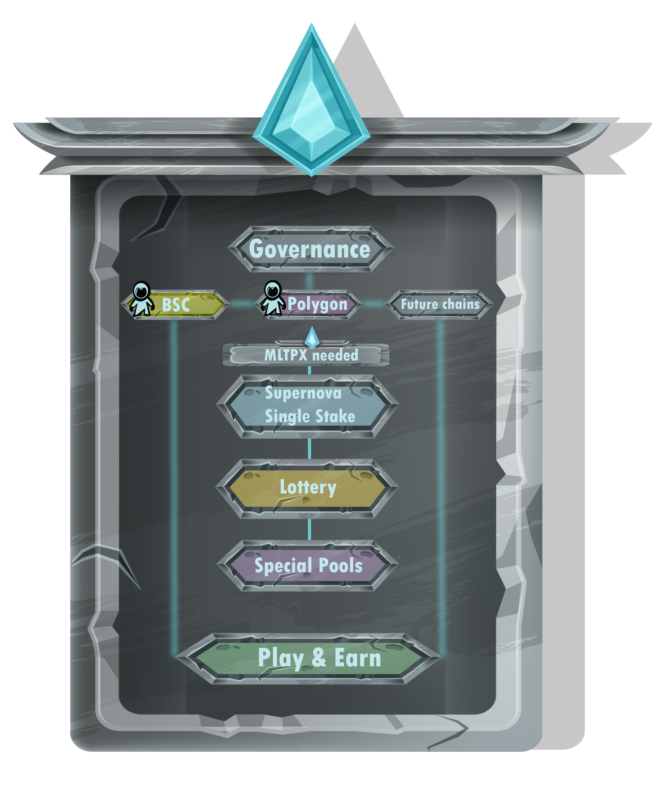
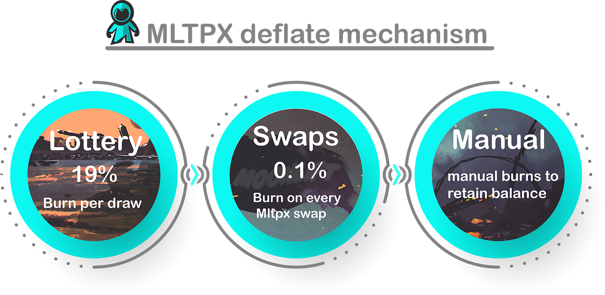

# 👩‍🚀 MLTPX

* **Ticker:** MLTPX
* **Contract Adress:**
* **Chain:**

MLTPX is a user driven project and therefore values the participation of the community. Governance \(voting\) is the implementation of this. Governance will give members a say by enabling MLTPX holders to vote and also create reviewed topics. This is a key application to regulate all other functionalities across the DEX.

MLTPX currently connects through Binance Smart Chain \(BSC\) and Polygon. Possibly more chains in the future. MLTPX is used for all internal DEX functions. You need to stake MLTPX for Supernova and Special Pools and use it for the Lottery. By doing this you can earn secondary tokens which you can trade or use for Play & Earn and the NFT Marketplace.

For deflating we have a few mechanisms. 19% of each lottery draw is burned. 1% is allocated for funding purposes \(marketing, development\). 80% remains in the lottery prize pools. Each MLTPX Pairing on the Swap will burn 0.1% per transaction. What remains is manual burns to retain balance and to positively influence the MTLPX course.

## Purpose of Tokenomics

MLTPX is a deflationary token with a hard cap. This also suits our vision of involving the community. The capacity will only decrease, so holders will be centivized to hold longer. With our governance, we share a big part of responsibility concerning the future of MoonLift with the community itself. 

For all our creative events such as Play & Earn & NFT's we use our secondary tokens which are more liquid and thereby create a possible infinite stream of activity on our DEX.

Make sure to check out our secondary tokens for a better understanding of the interaction.  

