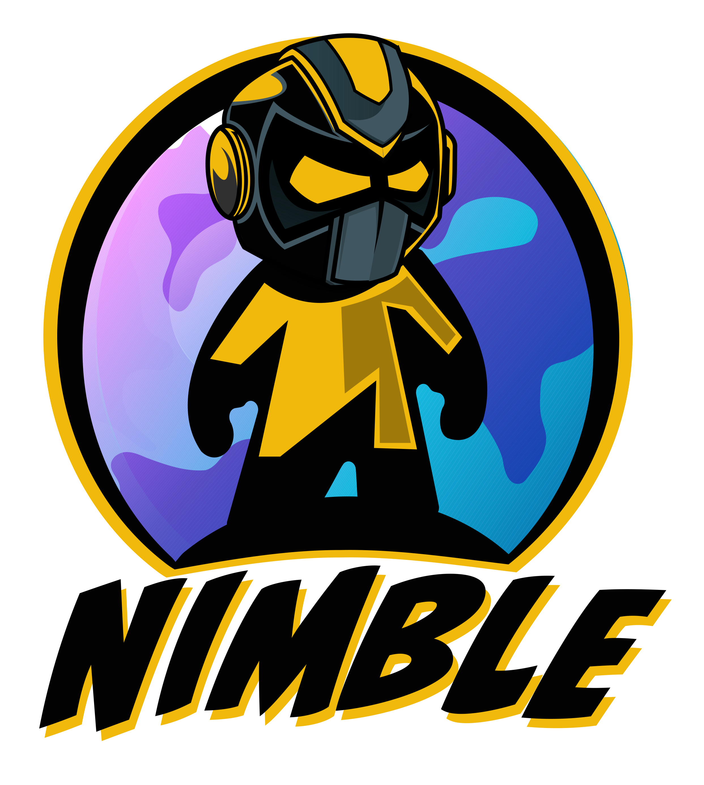

# 🤖 Nimble

* **Ticker:** 
* **Contract Adress:**
* **Chain:** 

## Summary

Nimble is the implementation of our second token running on Binance Smart Chain, supporting the MLTPX ecosystem.

Obtain Nimble by purchase, from Supernova or from lottery. Then make it work for you by;

* Staking it in farms.
* Creating your MoonLift Profile and mint NFT's.
* Competing in Play & Earn.

